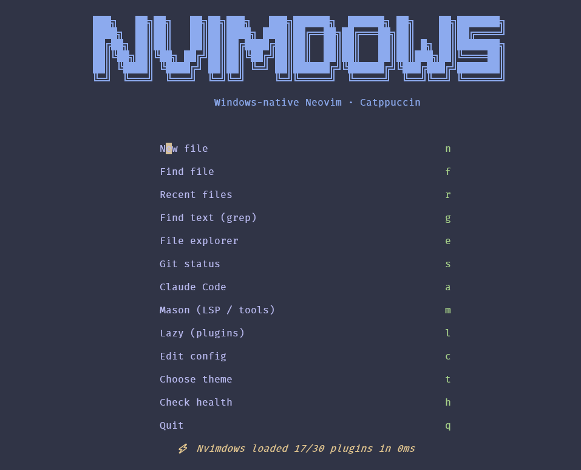

# Nvimdows — Neovim on Windows 11, Fully Configured

A ready-to-launch, Catppuccin-themed Neovim distribution branded **Nvimdows**:
LSP-backed completion, Treesitter, fuzzy finding, a file tree, git signs, an
embedded Claude Code panel, and a branded start screen with quick-launch
buttons for all of it. Everything auto-installs on first launch via
`lazy.nvim` — **except the external tools below, which cannot be bundled in
a Lua config and must be on your `PATH` first.**



## 1. Prerequisites (install these before opening Neovim)

Run these in an elevated PowerShell prompt (`winget` ships with Windows 11):

```powershell
winget install -e --id Neovim.Neovim
winget install -e --id Git.Git
winget install -e --id OpenJS.NodeJS.LTS        # required by the TS/JSON/HTML/CSS language servers
winget install -e --id BurntSushi.ripgrep.MSVC  # powers Telescope's live_grep
winget install -e --id sharkdp.fd               # faster file listing for Telescope
winget install -e --id zig.zig                  # C compiler used to build Treesitter parsers
winget install -e --id junegunn.win32yank       # fast, reliable OS clipboard integration
winget install -e --id Microsoft.PowerShell     # pwsh; the config's default shell if present
```

Also install:

| Requirement | Why | How |
|---|---|---|
| **Python 3** | `pyright` (Python LSP) and the `black` formatter | `winget install -e --id Python.Python.3.12` |
| **A Nerd Font** | File/git icons render as boxes without one | `winget install -e --id DEVCOM.CascadiaCodeNerdFont`, then set it as your terminal's font (Windows Terminal → Settings → Profile → Appearance → Font face) |
| **Claude Code CLI** | Powers the in-editor AI panel (`claude-code.nvim`) | You already have this (`npm install -g @anthropic-ai/claude-code` if not); run `claude` once outside Neovim to confirm you're logged in |
| **`make` + `gcc`** *(optional)* | Builds LuaSnip's native `jsregexp` lib, needed only for snippet variable/placeholder transformations — everything else about completion/snippets works without it. `zig` (above) can't substitute here: this native Windows `make` runs recipes via raw `CreateProcess` with no shell, so a multi-word compiler override like `zig cc` can't be resolved as one executable. Silently skipped if missing — never breaks the rest of the install. | `winget install -e --id ezwinports.make` and `winget install -e --id BrechtSanders.WinLibs.POSIX.UCRT` (bundles `gcc`) |

Restart your terminal after installing so `PATH` updates take effect. Verify with:

```powershell
nvim --version; git --version; node --version; rg --version; fd --version; zig version; claude --version
```

## 2. Install the config

This repo *is* the config, laid out exactly as Neovim expects it. Point
`%LOCALAPPDATA%\nvim` at it — either copy the files, or symlink so future
`git pull`s in this repo update your live config:

```powershell
# Back up any existing config first
if (Test-Path "$env:LOCALAPPDATA\nvim") {
    Rename-Item "$env:LOCALAPPDATA\nvim" "$env:LOCALAPPDATA\nvim.bak"
}

# Symlink (run as Administrator, or with Developer Mode enabled)
New-Item -ItemType SymbolicLink -Path "$env:LOCALAPPDATA\nvim" -Target "C:\Users\magnus.sandstrom\Code\Repo\nvim_setup"
```

Then just launch:

```powershell
nvim
```

On first launch, `lazy.nvim` bootstraps itself and installs every plugin;
`mason.nvim` then installs the LSP servers and formatters. This takes 1–3
minutes and only happens once. Run `:Lazy` afterward to confirm everything
shows green, and `:Mason` to confirm the servers installed.

## 3. What's in here and why

| File | Purpose |
|---|---|
| [init.lua](init.lua) | Entry point: sets the leader key, then loads everything else |
| [lua/config/options.lua](lua/config/options.lua) | Editor settings; includes a Windows-only block that sets `shell`/`shellslash` for `pwsh` |
| [lua/config/keymaps.lua](lua/config/keymaps.lua) | Keymaps not owned by a specific plugin |
| [lua/config/autocmds.lua](lua/config/autocmds.lua) | Yank highlight, cursor restore, trim-trailing-whitespace-on-save |
| [lua/config/lazy-bootstrap.lua](lua/config/lazy-bootstrap.lua) | Installs `lazy.nvim` itself if missing, then loads `lua/plugins/*` |
| [lua/plugins/colorscheme.lua](lua/plugins/colorscheme.lua) | Catppuccin theming — active flavour comes from `lua/config/theme.lua`, defaults to mocha |
| [lua/config/theme.lua](lua/config/theme.lua) | Persists your chosen Catppuccin flavour (latte/frappe/macchiato/mocha) across restarts and applies it live via the theme picker |
| [lua/plugins/dashboard.lua](lua/plugins/dashboard.lua) | The Nvimdows start screen (alpha-nvim) — ASCII banner + quick-launch buttons, including the theme picker, shown only when Neovim opens with no file argument |
| [lua/plugins/treesitter.lua](lua/plugins/treesitter.lua) | Accurate syntax highlighting/indent via real parsing (needs the `zig` compiler installed above) |
| [lua/plugins/lsp.lua](lua/plugins/lsp.lua) | Mason + lspconfig (diagnostics, go-to-def, hover, rename) + conform.nvim (format-on-save) |
| [lua/plugins/completion.lua](lua/plugins/completion.lua) | nvim-cmp — the completion popup, fed by LSP/snippets/buffer/path sources. Also builds LuaSnip's optional `jsregexp` native lib (needs `make` + `gcc` from above) |
| [lua/plugins/claude-code.lua](lua/plugins/claude-code.lua) | Docks the `claude` CLI in a terminal split — the AI agent integration |
| [lua/plugins/telescope.lua](lua/plugins/telescope.lua) | Fuzzy file/text/symbol search (needs `ripgrep` + `fd` installed above) |
| [lua/plugins/neo-tree.lua](lua/plugins/neo-tree.lua) | Sidebar file explorer |
| [lua/plugins/lualine.lua](lua/plugins/lualine.lua) | Statusline |
| [lua/plugins/gitsigns.lua](lua/plugins/gitsigns.lua) | Git diff markers in the sign column |
| [lua/plugins/editing.lua](lua/plugins/editing.lua) | which-key (keymap hints), autopairs, Comment.nvim, indent guides |

## 4. Keymap cheat sheet

Leader is `Space`. Press it and wait — `which-key` pops up a menu of
everything below, so you don't need to memorize this table.

| Keys | Action |
|---|---|
| `<leader>ff` / `fg` / `fb` / `fr` | Find files / grep / buffers / recent files |
| `<leader>e` | Toggle file tree |
| `<leader>ac` | Toggle Claude Code panel |
| `<leader>ct` | Choose theme (Catppuccin latte / frappe / macchiato / mocha) — choice persists across restarts |
| `<C-,>` | Quick-toggle Claude Code panel (works while inside its terminal too) |
| `gd` / `gr` / `K` | Go to definition / references / hover docs (LSP, only in buffers with a server attached) |
| `<leader>rn` / `ca` | Rename symbol / code action |
| `<leader>f` | Format current buffer |
| `[d` / `]d` | Previous/next diagnostic |
| `]h` / `[h` | Next/previous git hunk |
| `<C-h/j/k/l>` | Move between splits |

The Nvimdows start screen (shown when you launch plain `nvim` with no file
argument) lists its own keys next to each button — press the highlighted
letter, or click/`<CR>` on a line, to launch that action directly.

## 5. Customizing

- **Change theme flavor**: press `<leader>ct` or the "Choose theme" button on the start screen and pick latte (light), frappe, macchiato, or mocha — it switches immediately and is remembered for next launch (stored in `stdpath("state")/nvimdows-theme.txt`, managed by [lua/config/theme.lua](lua/config/theme.lua)). To change the *default* for a first-ever launch, edit the fallback in `theme.load()`. Swapping away from Catppuccin entirely (e.g. to `tokyonight`) means replacing [lua/plugins/colorscheme.lua](lua/plugins/colorscheme.lua) and [lua/config/theme.lua](lua/config/theme.lua), plus updating each other plugin's `integrations`/`theme` field that references `"catppuccin"`.
- **Add an LSP server**: find its Mason name at `:Mason`, add it to `ensure_installed` in [lua/plugins/lsp.lua](lua/plugins/lsp.lua), and add an entry (even an empty `{}`) to the `servers` table in the same file.
- **Add a formatter**: add the tool to `ensure_installed` in the `mason-tool-installer` block and map it to a filetype in `formatters_by_ft`, both in [lua/plugins/lsp.lua](lua/plugins/lsp.lua).
- **Swap the AI integration**: `claude-code.nvim` was chosen because it just wraps the CLI you already use, which makes it robust to plugin API changes. If you'd rather have inline AI diffs/chat native to Neovim against a raw Anthropic API key instead of the CLI, replace [lua/plugins/claude-code.lua](lua/plugins/claude-code.lua) with `yetone/avante.nvim` or `olimorris/codecompanion.nvim` — both support Claude models directly.
- **Add a new plugin**: drop a new file in `lua/plugins/` returning a lazy.nvim spec table; it's picked up automatically, nothing else to wire up.
- **Rebrand or re-theme the start screen**: the banner text and every button live in [lua/plugins/dashboard.lua](lua/plugins/dashboard.lua) as plain Lua tables — edit `dashboard.section.header.val` for the ASCII art (regenerate one at [patorjk.com/software/taag](https://patorjk.com/software/taag/) with the "ANSI Shadow" font) and `dashboard.section.buttons.val` to add/remove menu entries.

## 6. Troubleshooting

| Symptom | Fix |
|---|---|
| Icons show as boxes/question marks | Terminal isn't using the Nerd Font yet — set it in your terminal's profile settings, not just install it |
| `:TSUpdate` / parser install fails | No C compiler on PATH — confirm `zig version` works; restart the terminal after installing |
| `:Mason` installs hang or fail silently | Often antivirus/Defender blocking the download — check `:MasonLog`; corporate proxies may need `$env:HTTPS_PROXY` set before launching `nvim` |
| Clipboard (`y`/`p` to system clipboard) not working | Confirm `win32yank.exe` is on `PATH` (`Get-Command win32yank`); run `:checkhealth` for the exact provider error |
| `<leader>ac` does nothing / errors | `claude` isn't on `PATH`, or you haven't logged in yet — run `claude` directly in a terminal first |
| `lua_ls` error: "Your workspace is set to `X`. Lua language server refused to load this directory" | It walked up from your file and found a `.git` folder at `X` (commonly your home directory, if you keep dotfiles under version control there) and refuses to index that much of your disk as a safety measure. Either open Neovim from inside a proper project folder, or add a `.luarc.json` in the folder you want treated as the project root — see the [lua-language-server FAQ](https://luals.github.io/wiki/faq#why-is-the-server-scanning-the-wrong-folder) |
| Garbled `:!` command output or shell errors | Confirm `pwsh` is installed; if you'd rather use `cmd.exe`, delete the Windows-specific `shell`/`shellcmdflag` block in [lua/config/options.lua](lua/config/options.lua) and Neovim falls back to its own default |
| `npm error 'node' is not recognized` during a `:Mason` install, even though `node --version` works fine in your terminal | The Neovim/terminal process that hit this was launched with a stale environment snapshot from *before* Node/PATH was set up — Windows doesn't refresh a running process's environment. Reopening a terminal tab isn't enough if its host app (Windows Terminal, VS Code, etc.) has been running since before the fix; fully quit that host process, or reboot with **Restart** rather than **Shut Down** (Windows' Fast Startup hibernates rather than fully restarts on a normal shutdown, so stale environments can survive it) |
| `:checkhealth mason` warns `luarocks: unsupported version` / `:checkhealth lazy` says `luarocks not installed` | Cosmetic if you see it — both checkhealth outputs say outright *"no plugins require luarocks, so you can ignore any warnings below"*, and nothing in this config installs anything via LuaRocks. Only fix it (install LuaRocks ≥3.0.0) if you plan to `:MasonInstall` a package that specifically requires it |
| Upgraded LuaRocks but the warning still shows the old version | You likely have two LuaRocks installs and an older one resolves first on `PATH` (common if a very old "Lua for Windows" install, e.g. under `Program Files (x86)\Lua\5.1`, is still around from years ago). Check with `where.exe luarocks` to see every match in `PATH` order, then move the newer one's directory earlier — in both **User** *and* **System** `PATH` (`[Environment]::GetEnvironmentVariable("Path", "Machine")` needs an elevated PowerShell to edit), since Windows resolves System `PATH` entries before User ones |
| `:checkhealth lazy` additionally warns `lua5.1`/`lua-5.1` not installed, after fixing the above | Same "ignore it" family — LuaRocks wants a Lua 5.1 interpreter to build rocks against (to match Neovim's embedded LuaJIT), but nothing here installs anything via LuaRocks, so there's nothing to build |
| `:checkhealth luasnip` warns about missing `jsregexp` | Only affects snippet *variable/placeholder transformations* — everything else about snippets/completion works without it. Install `make` and `gcc` (see prerequisites above) and run `:Lazy build LuaSnip` |
| `vim.health` reports `Locale does not support UTF-8` | Usually a false positive on Windows — that check looks for POSIX `$LANG`/`$LC_ALL`/`$LC_CTYPE`, which Windows terminals don't use (they rely on the console code page instead), and doesn't reflect whether Unicode actually renders. If icons/box-drawing genuinely look wrong, that's the Nerd Font issue above, not this. If you want the check itself to go green, add `$env:LANG = "en_US.UTF-8"` to your PowerShell `$PROFILE` — it has to be set before Neovim starts, so setting it from inside the config is too late |
